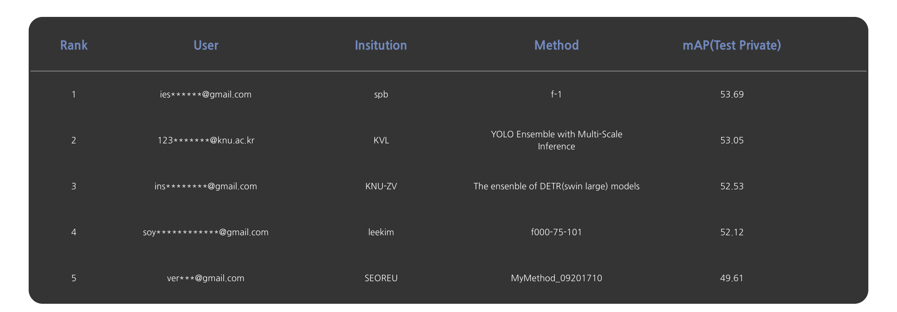

# IR sensor, AI 객체탐지 challenge
IR sensor dataset을 AI 객체 탐지하는 challenge의 솔루션.
최종 리더보드 기준 2nd



weight와 dataset의 다운받을 수 있으며, 이를 이용하면 아래의 과정을 순서대로 진행하지 않고 각각 단계를 독립적으로 테스트해볼수 있음.

## 환경세팅
1. Docker사용(권장)
```bash
cd docker_script
./make_image.sh # 도커 이미지 생성
./run_image.sh # 컨테이너 생성

cd /home/{IR_detection path}

cd mmdetection && pip install -e . && cd ..
cd mmyolo && pip install -e . && cd ..

```

2. Conda 환경
```bash
sudo apt-get install -y libxrender-dev libxext6 libsm6 ffmpeg git ninja-build libglib2.0-0 cmake
git clone https://github.com/ies0411/IR_detection.git
cd IR_detection

conda env create -f environment.yml
conda activate ir_env
pip install -r requirements.txt
mim install --no-cache-dir "mmengine>=0.6.0" "mmcv>=2.0.0rc4,<2.1.0" "mmdet>=3.0.0,<4.0.0"

cd mmdetection && pip install -e . && cd ..
cd mmyolo && pip install -e . && cd ..

```
## folder-tree
weight와 dataset, 소스코드을 다운받아서 아래와 같이 dataset과 weight의 폴더 위치를 구성함


### 다운로드 링크
- [Datasets](https://drive.google.com/drive/folders/1vp1iHQp3Z4NPxmNMKlu0dyp4ZU6xN1ik?usp=sharing)
- [weights](https://drive.google.com/drive/folders/1r7GNUqZE6Biy0Z84dUCKnO_6TrwV9vCj?usp=sharing)
- [output](https://drive.google.com/drive/folders/1a0JRH5OmojIlM5VV7ljROVux-V64pTxD?usp=sharing)
- [submit_output](https://drive.google.com/drive/folders/1w2hBoYU-hfuvDyaEIXarFy6Zg_Qb3RT1?usp=sharing)


## Preprocessing data
tools/combine_dataset.ipynb 의 모든 셀을 순차대로 실행하여 train/val의 데이터셋을 합침
baseline모델을 선정후에는 train/val의 모든 데이터를 학습용 데이터로 함 -> submit제출 횟수의 제한이 없기에 가능

## Train launcher
yolox training 실행
```bash
cd launcher
./train_yolox.sh
```

ppyoloe training 실행
```bash
cd launcher
./train_ppyoloe.sh
```

codetr(resnet101) training 실행
```bash
cd launcher
./train_codetr_resnet.sh
```


codetr(swin) training 실행
```bash
cd launcher
./train_codetr_swin.sh
```

## pseudo labeling(co-detr model only)
extra dataset을 pseudo labeling작업을 통해 training data로 편입

앞서 training을 통해 학습시킨 co-detr(swin)모델을 이용해서 아래 코드를 실행시켜 extra dataset을 만듬
```bash
extra_data_pseudo_label.ipynb
```
-  모든 셀 수행, checkpoints경로를 앞서 training을 통해 나온 최종 pth로 설정한다. 그리고 500개의 extra data를 추가해서 학습을 진행하서면 개선된 모델 weight로 다시 pseudo label을 생성한다. extra data의 개수도 500개씩 점진적으로 늘린다.

```bash
combine_pseudo_data.ipynb
```
-  pseudo labeling을 기존의 dataset의 annotation에 합치는 코드이며 모든 셀을 실행시킨다.

pseudo label을 통해 extra data를 추가하면 다시 아래의 script를 통해 추가 학습을 진행하며 이를 반복함

codetr(resnet101) pseudo label을 포함한 train 실행
```bash
cd launcher
./train_codetr_resnet2.sh
```


codetr(swin) pseudo label을 포함한 train 실행
```bash
cd launcher
./train_codetr_swin2.sh
```

이를 반복함 (리소스의 한계로 최대 pseudo label을 점진적으로 증가시켜 1500개까지만 사용하였음)

### 참고
codetr(swin)의 pretrained model을 만드는 과정
```bash
cd mmdetection
python train.py projects/configs/codino/pretrained_swin.py
```
extra dataset들을 더 추가해서 학습을 진행하였고 backbone의 weight들에 가중치를 부여하고 epoch가 진행될때 마다 점점 가중치를 줄여가서 학습을 진행


## Inference launcher
### yolox
- 최종 학습된 model weight 사용해서 base scale과 tta를 적용한 두개의 inference 결과 출력
```bash
cd launcher
./inference_yolox.sh
```

### ppyoloe
- 최종 학습된 model weight 사용해서 base scale과 tta를 적용한 두개의 inference 결과 출력
```bash
cd launcher
./inference_ppyoloe.sh
```

### codetr(resnet101) 실행
- pseudo label을 사용하지 않은 model weight 통해 base scale과 tta를 적용한 두개의 inference 결과
- pseudo label(1500)을 사용한 model weight 통해 base scale과 tta를 적용한 두개의 inference 결과
- 총 4개의 inference 결과
```bash
cd launcher
./inference_codetr_resnet.sh
```

### codetr(swin) 실행
- pseudo label을 사용하지 않은 model weight 통해 base scale과 tta를 적용한 두개의 inference 결과
- pseudo label(500개)을 사용한 model weight 통해 base scale과 tta를 적용한 두개의 inference 결과
- pseudo label(1500개)을 사용한 model weight 통해 multi-scale 를 적용한 4개의 inference 결과
- 총 8개의 inference 결과

```bash
cd launcher
./inference_codetr_swin.sh
```

## Ensemble
최종 submit결과 (모델 각각의 results를 다운받으면 단독으로 실행 가능)

inference launcher를 통해 output 폴더에 다양한 모델의 multi-sie 또는 tta를 적용한 inference결과가 저장됨 -> WBF를 통해 앙상블을 진행 -> submit_output폴더에 최종 submit형식의 txt파일이 생성

```bash
cd tools
python3 ensemble.py
```

## Ref
mmdetection
```bash
@article{mmdetection,
  title   = {{MMDetection}: Open MMLab Detection Toolbox and Benchmark},
  author  = {Chen, Kai and Wang, Jiaqi and Pang, Jiangmiao and Cao, Yuhang and
             Xiong, Yu and Li, Xiaoxiao and Sun, Shuyang and Feng, Wansen and
             Liu, Ziwei and Xu, Jiarui and Zhang, Zheng and Cheng, Dazhi and
             Zhu, Chenchen and Cheng, Tianheng and Zhao, Qijie and Li, Buyu and
             Lu, Xin and Zhu, Rui and Wu, Yue and Dai, Jifeng and Wang, Jingdong
             and Shi, Jianping and Ouyang, Wanli and Loy, Chen Change and Lin, Dahua},
  journal= {arXiv preprint arXiv:1906.07155},
  year={2019}
}
```

mmyolo
```bash
@misc{mmyolo2022,
    title={{MMYOLO: OpenMMLab YOLO} series toolbox and benchmark},
    author={MMYOLO Contributors},
    howpublished = {\url{https://github.com/open-mmlab/mmyolo}},
    year={2022}
}
```

roboflow IR data
```bash
@misc{
v7-zupa6_dataset,
title = { v7 Dataset },
type = { Open Source Dataset },
author = { hossam },
howpublished = { \url{ https://universe.roboflow.com/hossam-xkzry/v7-zupa6 } },
url = { https://universe.roboflow.com/hossam-xkzry/v7-zupa6 },
journal = { Roboflow Universe },
publisher = { Roboflow },
year = { 2023 },
month = { jan },
note = { visited on 2024-09-27 },
}
```

roboflow IR data
```bash
@misc{
v7-zupa6_dataset,
title = { v7 Dataset },
type = { Open Source Dataset },
author = { hossam },
howpublished = { \url{ https://universe.roboflow.com/hossam-xkzry/v7-zupa6 } },
url = { https://universe.roboflow.com/hossam-xkzry/v7-zupa6 },
journal = { Roboflow Universe },
publisher = { Roboflow },
year = { 2023 },
month = { jan },
note = { visited on 2024-09-27 },
}
```
